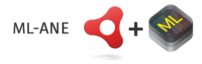

CoreML Adobe Air Native Extension for OSX 10.13+ and iOS 11.0+
This ANE provides access to Apple's CoreML framework for building Machine Learning apps

-------------

Much time, skill and effort has gone into this. Help support the project

[](https://www.paypal.com/cgi-bin/webscr?cmd=_s-xclick&hosted_button_id=5UR2T52J633RC)

-------------

## OSX

### The ANE + Dependencies

From the command line cd into /example-desktop and run:

````shell
bash get_dependencies.sh
`````

## iOS

### The ANE + Dependencies

N.B. You must use a Mac to build an iOS app using this ANE. Windows is NOT supported.

From the command line cd into /example-mobile and run:

````shell
bash get_ios_dependencies.sh
`````

This folder, ios_dependencies/device/Frameworks, must be packaged as part of your app when creating the ipa. How this is done will depend on the IDE you are using.
After the ipa is created unzip it and confirm there is a "Frameworks" folder in the root of the .app package.

### Getting Started

Firstly, familiarise yourself with the concepts of Apple's CoreML.

### Usage
#### Check CoreML is supported
````actionscript
coreml = MLANE.coreml;
if (coreml.isSupported) {

} else {

}
`````

#### Download Model from url and compile
````actionscript
var mobileNetUrl:String = "https://docs-assets.developer.apple.com/coreml/models/MobileNet.mlmodel"
var model:Model = Model.fromUrl(mobileNetUrl, onDownloadProgress, onDownloadComplete, onModelCompiled);
private function onDownloadProgress(event:ProgressEvent):void {
//
}
private function onDownloadComplete(event:Event):void {
//
}
private function onModelCompiled(event:ModelEvent):void {
    model.load();
}
````

#### load Model from storage directory and compile
````actionscript
var model:Model = Model.fromPath(File.applicationStorageDirectory.resolvePath("MobileNet.mlmodel").nativePath, onCompiled);
private function onModelCompiled(event:ModelEvent):void {
    model.load();
}
``````

#### perform prediction with bitmapData as input
````actionscript
var testImage:Bitmap = new TestImage() as Bitmap;
var mobileNet:MobileNet = new MobileNet(testImage.bitmapData);
    model.prediction(mobileNet, onMobileNetResult);
}
``````

### Prerequisites

You will need:
- a Mac. Windows is not supported
- IntelliJ IDEA
- AIR 28
- Xcode 9.1 if you wish to edit the iOS source
- wget on OSX

### Task List
- [x] Sample input Models (MobileNet, SqueezeNet and Apple Mars)
* Inputs
    - [x] Image
    - [x] Double
    - [x] String
    - [ ] Dictionary
    - [ ] MultiArray
    - [x] Camera (iOS)
    - [ ] Camera Roll (iOS)
* Outputs
    - [ ] Image
    - [x] Double
    - [x] String
    - [ ] MultiArray
    - [x] Dictionary

### References
* [https://developer.apple.com/documentation/coreml]
